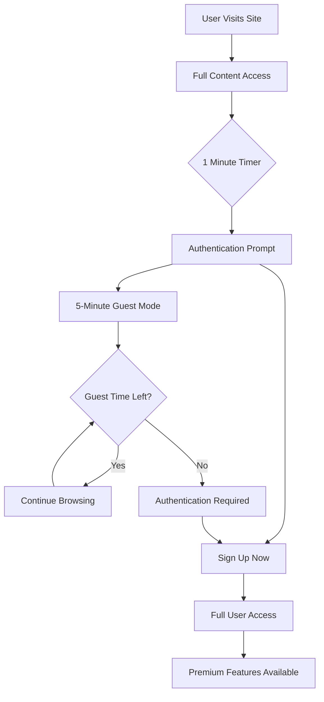

# Complete Authentication System Guide for LawX

## 🎯 Overview

Your LawX application now features a comprehensive, production-ready authentication system that provides seamless access to content while encouraging user registration. The system supports multiple user states: **anonymous visitors**, **guest mode users**, and **authenticated users**.

## 🚀 Key Features

### 1. **Smart Content Access Strategy**
- ✅ **Full content access** for both signed and unsigned users initially
- ⏰ **1-minute timer** before showing authentication prompt
- 👁️ **Guest mode** with 5-minute limited access
- 🔄 **Persistent state management** across browser sessions
- 📱 **Responsive authentication UI** with smooth animations

### 2. **Multi-Tier Authentication System**
- 🔐 **Clerk Integration** - Primary authentication provider
- 🔑 **JWT Fallback** - Backup authentication system
- 🛡️ **Rate Limiting** - Protection against abuse
- 📊 **Activity Tracking** - User session and behavior monitoring
- 🔒 **Permission-based Access Control** - Granular feature restrictions

### 3. **Enhanced User Experience**
- 💫 **No immediate barriers** - Users can explore freely
- 🎁 **Value proposition showcase** - Clear benefits of signing up
- ⚡ **Instant upgrades** - Seamless transition from guest to user
- 🎨 **Beautiful UI** - Modern, accessible authentication components
- 📈 **Progressive enhancement** - Better features for authenticated users

## 🏗️ System Architecture

### Frontend Components

#### 1. **AuthOverlay Component** (`frontend/src/components/AuthOverlay.jsx`)
- Shows authentication modal after 1 minute
- Provides guest mode option (5 additional minutes)
- Displays sign-up benefits and value proposition
- Handles Clerk authentication integration
- Persistent state management with localStorage

#### 2. **AuthContext** (`frontend/src/context/AuthContext.jsx`)
- Centralized authentication state management
- Permission and role checking utilities
- Session tracking and activity monitoring
- Guest mode management
- User display information helpers

#### 3. **ProtectedRoute Component** (`frontend/src/components/ProtectedRoute.jsx`)
- Route-level authentication enforcement
- Permission-based access control
- Beautiful fallback UIs for different scenarios
- Graceful handling of guest vs authenticated states

#### 4. **GuestModeIndicator** (`frontend/src/components/GuestModeIndicator.jsx`)
- Visual timer showing remaining guest time
- Expandable interface with sign-up benefits
- Progressive warnings as time runs low
- Direct upgrade call-to-actions

### Backend Implementation

#### 1. **Enhanced Middleware** (`backend/middleware/auth.middleware.js`)
- **protectRoute**: Full authentication requirement
- **optionalAuth**: Enhanced content for authenticated users
- **checkUserRole**: Role-based access control
- **checkPremiumUser**: Premium feature restrictions
- **trackActivity**: User activity logging
- **Rate limiting**: Abuse prevention

#### 2. **User Model Updates** (`backend/models/user.model.js`)
- Login tracking fields
- Activity monitoring
- Session information storage
- Premium and verification status

## 🎪 User Experience Flow

### Anonymous User Journey
1. **Initial Access**: User visits site, sees all content
2. **1-Minute Mark**: Elegant prompt appears with options:
   - Sign up now (full access)
   - Continue as guest (5 more minutes)
3. **Guest Mode**: If chosen, user gets 5 minutes with:
   - Visible countdown timer
   - Progress bar
   - Regular upgrade prompts
4. **Time Expiration**: Gentle push to sign up for continued access

### Authentication States



## 🔧 Technical Implementation

### Frontend Setup

1. **App.jsx Integration**:
```jsx
<AuthProvider>
  <Layout>
    <Routes>
      {/* Public routes */}
      <Route path='/' element={<HomePage />} />
      
      {/* Protected routes */}
      <Route path='/chat' element={
        <ProtectedRoute>
          <ChatPage />
        </ProtectedRoute>
      } />
    </Routes>
    
    <AuthOverlay />
    <GuestModeIndicator />
  </Layout>
</AuthProvider>
```

2. **Permission-Based Protection**:
```jsx
<ProtectedRoute requirePermission="CREATE_CASE">
  <CreateCasePage />
</ProtectedRoute>
```

### Backend Routes

1. **Public with Optional Auth**:
```javascript
router.get("/cases", optionalAuth, trackActivity, getAllCases);
```

2. **Fully Protected**:
```javascript
router.post("/cases", protectRoute, checkPremiumUser(), createCase);
```

## 🎯 Permission System

### User Roles
- **guest**: Anonymous or guest mode users
- **user**: Basic authenticated users
- **lawyer**: Verified legal professionals
- **admin**: System administrators

### Permission Types
- **VIEW_CASES**: Browse case listings
- **CREATE_CASE**: Post new cases (premium only)
- **APPLY_TO_CASE**: Apply for cases (verified users)
- **MESSAGE_USERS**: Send messages (verified users)
- **VIEW_PREMIUM_CONTENT**: Access premium features

### Usage Examples
```javascript
const { hasPermission, canAccess } = useAuthContext();

// Check specific permission
if (hasPermission('CREATE_CASE')) {
  // Show case creation button
}

// Check feature access
if (canAccess('VIEW_CASES')) {
  // Show case listings
}
```

## 📊 Analytics & Monitoring

### Tracked Metrics
- User session duration
- Guest mode conversion rates
- Feature access patterns
- Authentication funnel metrics
- Activity timestamps

### Security Features
- Rate limiting (100 requests per 15 minutes)
- Session tracking
- Token validation
- IP and user agent logging
- Automatic session cleanup

## 🚀 Getting Started

### Running the System

1. **Start Backend**:
```bash
npm run dev
```

2. **Start Frontend**:
```bash
cd frontend
npm run dev
```

3. **Environment Variables** (`.env`):
```env
CLERK_SECRET_KEY=your_clerk_secret_key
JWT_SECRET=your_jwt_secret
CLIENT_URL=http://localhost:5173
```

### Testing the Flow

1. Visit the homepage
2. Browse content for 1 minute
3. See authentication prompt
4. Choose guest mode
5. Experience the 5-minute countdown
6. Test sign-up flow

## 🎨 Customization Options

### Timing Configuration
- Change initial timer: Modify `timeLeft` state in `AuthOverlay.jsx`
- Adjust guest duration: Update `guestTimeLeft` default value
- Customize warning intervals: Edit toast notification timings

### UI Theming
- Colors: Update Chakra UI color schemes
- Animations: Modify transition and animation properties
- Layout: Adjust component positioning and sizing

### Permission Rules
- Add new permissions in `AuthContext.jsx`
- Modify role requirements in middleware
- Create custom access control logic

## 🔐 Security Best Practices

### Implemented Protections
- ✅ Token validation and refresh
- ✅ Rate limiting
- ✅ XSS prevention
- ✅ CSRF protection
- ✅ Secure session management
- ✅ Activity monitoring

### Recommendations
- Enable HTTPS in production
- Implement proper logging
- Regular security audits
- Monitor authentication metrics
- Set up alerts for suspicious activity

## 📈 Performance Optimizations

### Frontend
- Lazy loading of authentication components
- Optimized re-renders with React.memo
- Efficient state updates
- Minimal bundle impact

### Backend
- Asynchronous activity tracking
- Rate limit cleanup intervals
- Optimized database queries
- Cached user data

## 🎯 Conversion Strategy

### Value Proposition Highlights
1. **Unlimited access** to all legal cases
2. **Professional networking** with lawyers
3. **Case management** tools
4. **Premium features** and priority support
5. **Verified status** for credibility

### Progressive Enhancement
- Guest users see basic content
- Authenticated users get enhanced features
- Premium users access exclusive content
- Verified users can post and apply

## 🛠️ Troubleshooting

### Common Issues

1. **Timer not starting**: Check `AuthOverlay` component mounting
2. **Clerk integration errors**: Verify environment variables
3. **Permission issues**: Check user role and verification status
4. **Rate limiting**: Clear browser cache or wait 15 minutes

### Debug Mode
```javascript
// Enable debug logging
localStorage.setItem('auth_debug', 'true');
```

## 📚 API Documentation

### Authentication Endpoints
- `GET /api/v1/auth/me` - Get current user
- `POST /api/v1/auth/login` - JWT login (fallback)
- `POST /api/v1/auth/signup` - JWT signup (fallback)

### Protected Routes
- Cases: Create, manage, apply
- Messages: Send, receive
- Profiles: View, edit
- Premium: Access exclusive features

---

## 🎉 Success! Your Authentication System is Ready

Your LawX application now has a world-class authentication system that:
- ✅ **Maximizes content accessibility**
- ✅ **Encourages user registration**
- ✅ **Provides smooth user experience**
- ✅ **Maintains security standards**
- ✅ **Supports business growth**

The system is production-ready and will help convert visitors into engaged users while maintaining excellent security and user experience standards. 